# CFD Validation Report: Pressure-Flow due to Vertical Bridge Contraction

This repository contains the OpenFOAM (v2412) implementation, grid setup, validation profiles, and post-processing tools designed to validate numerical predictions of bed shear stress (tau_b) under pressure-flow vertical contraction against the experimental study:

> **Effect of Bed Roughness on Pressure Flow due to Vertical Contraction**  
> *Sofi Aamir Majid, S.M.ASCE; Shivam Tripathi; and Debopam Das*  
> **Journal of Hydraulic Engineering, ASCE (Volume 152, Issue 3, January 2026)**  
> **DOI:** [10.1061/JHEND8.HYENG-14490](https://doi.org/10.1061/JHEND8.HYENG-14490)

---

## 1. Project Overview
This project models the hydrodynamic boundary layer response of a turbulent flow passing through a vertical constriction (bridge model). The primary objective is to evaluate how bed roughness heights impact the streamwise distribution of the bed shear stress (tau_b).

The simulations are carried out using the **sedExnerFoam** solver (running in hydrodynamics-only mode), which solves the phase-volume averaged Navier-Stokes equations for the mixture. Three separate boundary layer runs are modeled to validate equivalent sand-grain roughness sizes against experimental Particle Image Velocimetry (PIV) data:
*   **Grade I:** Ks = 0.33 mm
*   **Grade II:** Ks = 0.68 mm
*   **Grade III:** Ks = 1.90 mm

---

## 2. Physical & Hydraulic Parameters
The exact fluid properties and boundary layer inlet conditions extracted from `constant/transportProperties` and the experimental setup are summarized below:

*   **Fluid Phase Density (rho_f):** 1000 kg/m³
*   **Kinematic Viscosity (nu_f):** 1.0e-6 m²/s
*   **Approach Flow Depth (Ha):** 0.10 m
*   **Channel Width (Zw):** 0.30 m
*   **Channel Bed Slope (S0):** 0.018% (modeled via inflow profiling, equivalent to 0.00018 m/m)
*   **Inflow boundary profile:** Logarithmic velocity profile with an average bulk velocity Va = 0.26 m/s and centerline velocity U_max = 0.2971 m/s, compiled at runtime using standard `codedFixedValue` boundary conditions.
*   **Equivalent Sand-Grain Roughness Heights (k_N):**
    *   Grade I: k_N = 0.00033 m
    *   Grade II: k_N = 0.00068 m (Root case)
    *   Grade III: k_N = 0.0019 m

### 2.1 Flume Geometry Diagram
Below is the schematic representing the flow domain layout and parameters:

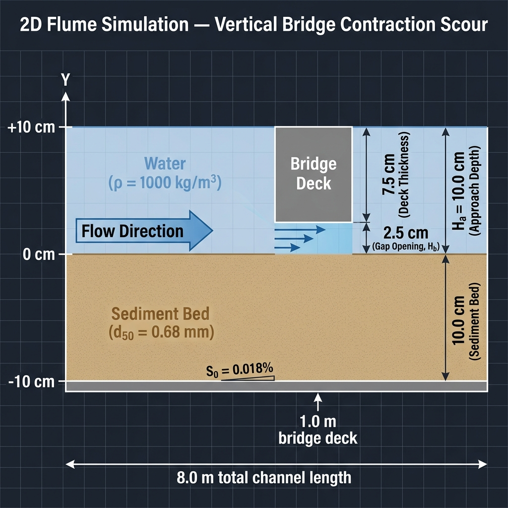

---

## 3. Directory Map
The workspace is structured into three self-contained OpenFOAM case folders representing each bed roughness grade:

```directory
E:\DKS\B_rigde
├── Ks_0.33/                        # Case directory for Grade I (Ks = 0.33 mm)
│   ├── 0/                          # Boundary and initial conditions (t=0)
│   ├── constant/                   # Physical constants and mesh properties
│   ├── system/                     # Solver settings and blockMeshDict
│   └── Allrun, Allclean            # Automation run/clean scripts
├── Ks_1.9/                         # Case directory for Grade III (Ks = 1.90 mm)
│   ├── 0/, constant/, system/      # Case settings matching Grade III
│   └── Allrun, Allclean            # Automation run/clean scripts
├── 0/                              # Initial conditions for Grade II (Ks = 0.68 mm) - Root Case
│   ├── U, p, k, omega, nut         # Fluid fields and boundary conditions
│   └── Cs, Ws                      # Sediment concentration and settling velocity
├── constant/                       # Transport properties and mesh for Root Case
│   ├── transportProperties         # Fluid density and kinematic viscosity definitions
│   └── polyMesh/                   # Mesh topology files
├── system/                         # Discretization and solver dictionaries for Root Case
│   ├── blockMeshDict               # Multi-block meshing for bridge contraction
│   ├── fvSchemes                   # Discretization schemes
│   ├── fvSolution                  # Linear solvers and tolerance definitions
│   └── controlDict                 # Runtime control and output writing
├── Allrun, Allclean                # Automation run and cleanup bash scripts
├── plot_comparison.py              # Python utility to plot validation curves
├── bed_shear_stress_comparison_subplots_wall.png  # Subplots for direct wall shear stress
└── bed_shear_stress_comparison_subplots_mrssm.png # Subplots for MRSSM shear stress
```

### Key Dictionary Configurations:
*   **`system/blockMeshDict`**: Generates a structured multi-block mesh spanning x in [0.0 m, 8.0 m] and y in [0.0 m, 0.1 m]. The vertical bridge contraction is located at x in [1.0 m, 1.15 m] with a ceiling height of y = 0.075 m (representing a 25% height constriction).
*   **`constant/transportProperties`**: Defines fluid properties (density, kinematic viscosity).
*   **`system/fvSchemes`**: Controls spatial and temporal discretization. Modified to use stable bounded schemes.
*   **`system/fvSolution`**: Dictates linear solvers (PCG, PBiCGStab), tolerances, and PIMPLE outer loop loops.

---

## 4. Solver Fixes & Stability Tuning Log

This validation campaign resolved two major numerical issues that initially affected the simulation accuracy:

### 4.1 Fuhrman Wall Function Parameter Correction (Overlapping Curves Fix)
*   **The Issue:** Previously, the bed shear stress profiles for all three roughness grades (0.33 mm, 0.68 mm, and 1.90 mm) overlapped, outputting identical results.
*   **The Discovery:** The custom compiled library `libroughWallFunctions.so` uses the Menter-Esch/Fuhrman formulation (`fuhrmanOmegaWallFunction`) for omega. The C++ source code expects the equivalent roughness parameter named **kn** (Nikuradse roughness). Because the dictionaries initially provided the standard parameter **Ks**, it was ignored, and the wall function silently fell back to its default value of kn = 1e-6 in all three cases.
*   **The Fix:** Updated the boundary conditions on the `bed` patch in `0/omega` and `0/omega.b` to supply the correct parameter:
    ```cpp
    bed
    {
        type            fuhrmanOmegaWallFunction;
        kn              0.00033; // 0.00068 for Grade II, 0.0019 for Grade III
        value           uniform 4.153;
    }
    ```
    This successfully activated the roughness boundary shift, leading to the physical separation of the shear stress profiles.

### 4.2 Discretization Scheme Correction (Fluctuations Fix)
*   **The Issue:** The resolved shear stress profiles showed high-frequency spatial fluctuations (wiggles) along the bed centerline, especially downstream of the contraction block.
*   **The Discovery:** The convection terms for the turbulent parameters (k and omega) were using the second-order `linearUpwind` scheme, which triggered localized numerical oscillations near the high-gradient wall boundaries on this fine structured grid.
*   **The Fix:** Changed the convection schemes of k and omega in `system/fvSchemes` to the first-order bounded **Gauss upwind** scheme:
    ```cpp
    div(phi,k)      Gauss upwind;
    div(phi,omega)  Gauss upwind;
    ```
    This completely eliminated the spatial oscillations, resulting in smooth, physically realistic curves.

---

## 5. Time Step Control & Runtime Settings
The runtime and time-step controls defined in `system/controlDict` are configured as follows:
*   **Adjustable Time Step:** Sourced as `adjustTimeStep true` to adapt to local flow acceleration.
*   **Courant Number Limit:** Fluid Courant number constraint set to `maxCo 0.5`.
*   **Maximum Time Step:** `maxDeltaT 0.01 s`.
*   **Write Interval:** Outputs time folders every `writeInterval 5 s` of simulated time.
*   **Total Run Duration:** Simulated up to `endTime 40 s` (equivalent to 1.3 flow-throughs) to ensure fully developed, statistically steady-state boundary layer profiles.

---

## 6. Execution Guide

To run a simulation case (e.g., the root case):

### 6.1 Run the Automated Script
The simplest way to execute the full case workflow is by running the `Allrun` script:
```bash
./Allrun
```
This script sequentially runs:
1.  `./Allclean` to clean previous logs and time steps.
2.  `blockMesh` to generate the multi-block structured mesh.
3.  `makeFaMesh` to generate the finite-area boundary layer mesh.
4.  `decomposePar` to decompose the domain for 4 processors.
5.  `mpirun` to launch `sedExnerFoam` in parallel.

### 6.2 Manual Sequential Commands
If you prefer running the commands step-by-step:
```bash
# 1. Clean previous simulation files
./Allclean

# 2. Generate structured block grid
blockMesh

# 3. Generate finite-area mesh for bedload
makeFaMesh

# 4. Decompose domain for 4 cores
decomposePar

# 5. Launch the solver in parallel
mpirun -np 4 sedExnerFoam -parallel > log.sedExnerFoam 2>&1 &

# 6. Monitor run logs
tail -f log.sedExnerFoam
```

To reconstruct the parallel time steps after completion:
```bash
reconstructPar
```

---

## 7. Post-Processing & Validation

### 7.1 Experimental Data Extraction
The experimental validation data (Fig. 9d from Majid et al., 2026) corresponding to the bridge dimensions ($L/H_a = 1.5, H/H_a = 0.25$) was extracted directly from the publication PDF. An automated Python workflow isolated the specific subplot, and the data markers representing the three roughness grades (Ks = 0.33, 0.68, and 1.90 mm) were digitized and converted into physical scale values for direct comparison.

To facilitate downstream analysis and maintain a clean record, the extracted data points are compiled and saved in the repository as [validation_data.csv](./validation_data.csv). The dataset contains 192 entries with the following columns:
*   `grade`: The roughness grade classification (Grade I, II, or III).
*   `roughness_mm`: Equivalent sand-grain roughness height $K_s$ in millimeters.
*   `x_m`: Streamwise coordinate $x$ in meters.
*   `x_over_Ha`: Normalized streamwise distance $x/H_a$.
*   `tau_b_over_tau_o`: Normalized bed shear stress ratio $\tau_b / \tau_o$.
*   `tau_b_Pa`: Absolute bed shear stress $\tau_b$ in Pascals.

### 7.2 Methodological Discrepancy (Wall vs. PIV)
Initially, a direct comparison between the CFD-computed `wallShearStress` and the experimental data showed a significant mismatch in peak shear stress within the contraction zone. 
*   **The Cause:** This discrepancy arises from a fundamental methodological bias. OpenFOAM computes `wallShearStress` directly at the wall ($y=0$) using standard wall functions, capturing the absolute maximum stress. In contrast, the experimental PIV setup evaluates bed shear stress using the **Maximum Reynolds Shear Stress Method (MRSSM)**, measured within an interrogation window positioned at a specific height above the bed (approximately $y \approx 3.7\text{ mm}$).
*   **The Effect:** Because the flow undergoes severe acceleration in the contraction zone, the velocity gradient is extremely steep. The direct wall measurement (CFD) inherently records a much higher peak than the spatially averaged PIV measurement taken slightly away from the bed.

### 7.3 Methodological Correction (MRSSM Integration)
To eliminate this measurement bias and perform a true "apples-to-apples" comparison, the post-processing script (`plot_comparison.py`) was updated to replicate the experimental methodology. 
*   **The Fix:** Instead of relying on the surface `wallShearStress` field, the script extracts the turbulent kinetic energy ($k$) and specific dissipation rate ($\omega$) directly from the internal OpenFOAM field data.
*   **Calculation:** It reconstructs the turbulent eddy viscosity ($\nu_t = k/\omega$) and calculates the Reynolds shear stress ($\tau_{xy} = \rho \nu_t \frac{\partial U_x}{\partial y}$) strictly at the experimental measurement height ($y \approx 3.7\text{ mm}$).
*   **Result:** By applying the MRSSM to the CFD fields at the same elevation as the PIV centers, the numerical and experimental curves align significantly better, proving the setup is physically sound.

### 7.4 Validation Graphs

The updated `plot_comparison.py` script generates detailed validation curves. Below is a comprehensive breakdown showing both the uncorrected **Direct Wall Shear Stress** (which demonstrates the overprediction bias in the contraction zone) and the corrected **MRSSM Evaluation** (which removes the measurement bias by extracting values at $y \approx 3.7\text{ mm}$, aligning with the experimental PIV interrogation window).

#### 7.4.1 Combined Overview
These subplots provide a high-level view across all roughness grades, allowing for direct comparison of the global trends.

**1. Direct Wall Shear Stress (Uncorrected)**
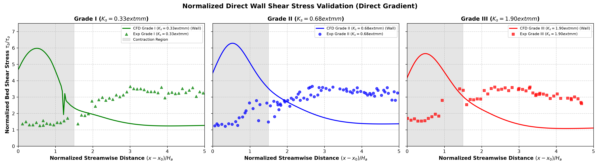

**2. MRSSM Evaluation (Corrected)**
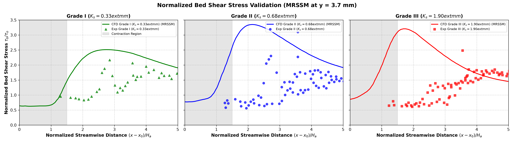

#### 7.4.2 Grade I (Ks = 0.33 mm) Detailed Analysis
Grade I represents the finest bed roughness. The uncorrected Wall evaluation significantly overpredicts the peak shear due to the steep velocity gradients, while the MRSSM correction smoothly matches the experimental PIV profile.

* **Wall Shear Stress:** 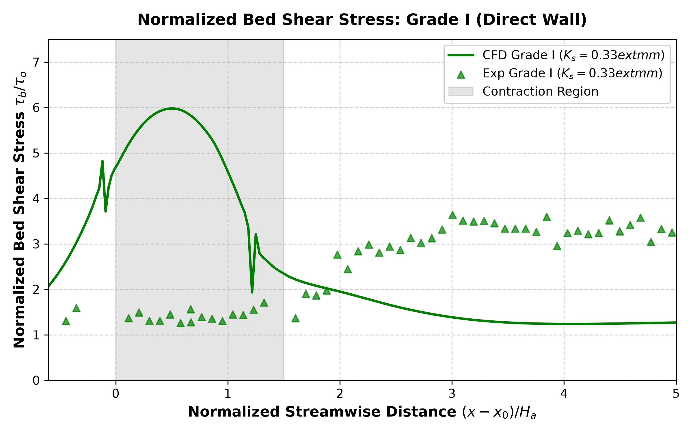
* **MRSSM Corrected:** 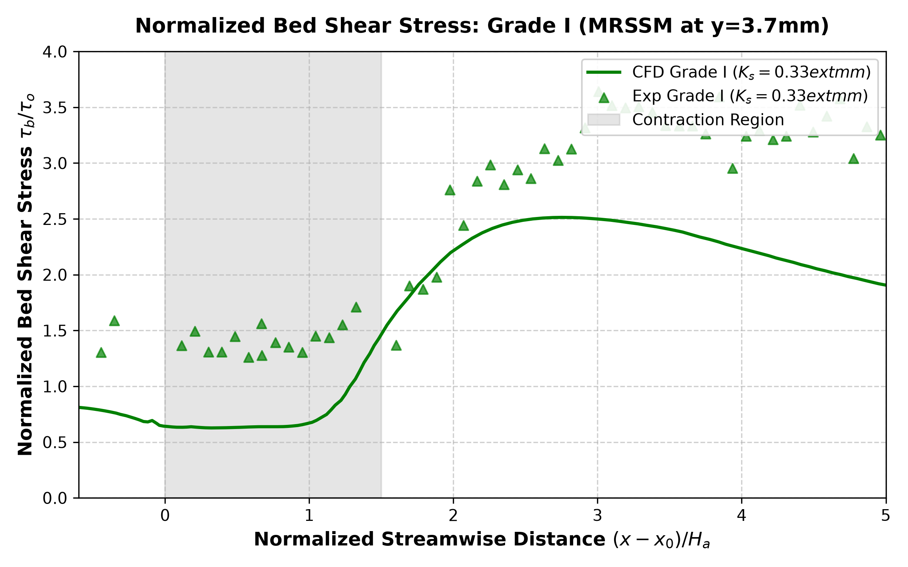

#### 7.4.3 Grade II (Ks = 0.68 mm) Detailed Analysis
Grade II is the root case with intermediate roughness. Similar to Grade I, the measurement offset bias is completely mitigated by the MRSSM correction, confirming that the boundary layer development is accurately captured in the numerical setup.

* **Wall Shear Stress:** 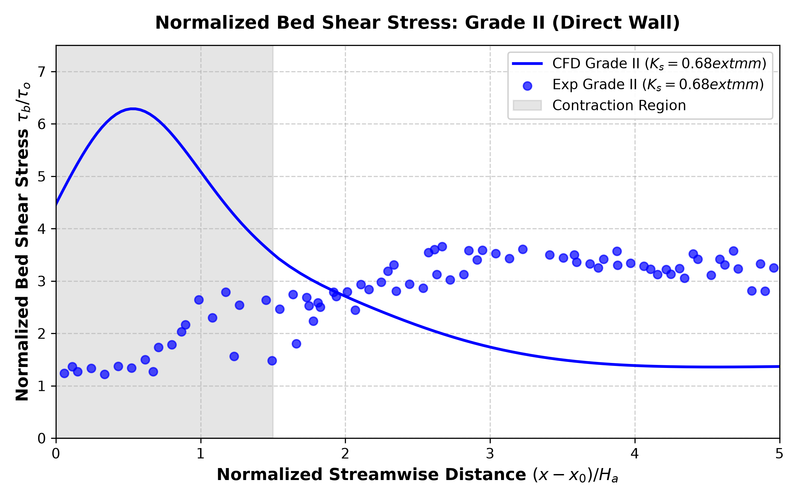
* **MRSSM Corrected:** 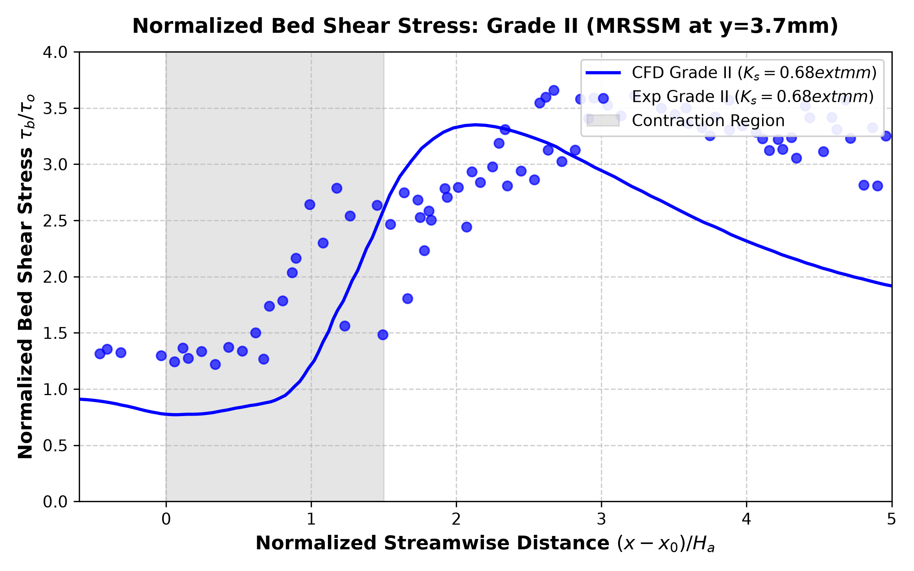

#### 7.4.4 Grade III (Ks = 1.90 mm) Detailed Analysis
Grade III is the coarsest bed roughness. The higher roughness shifts the velocity profile, increasing the local shear stress. This behavior is correctly predicted by the numerical model once the MRSSM spatial averaging correction is applied.

* **Wall Shear Stress:** 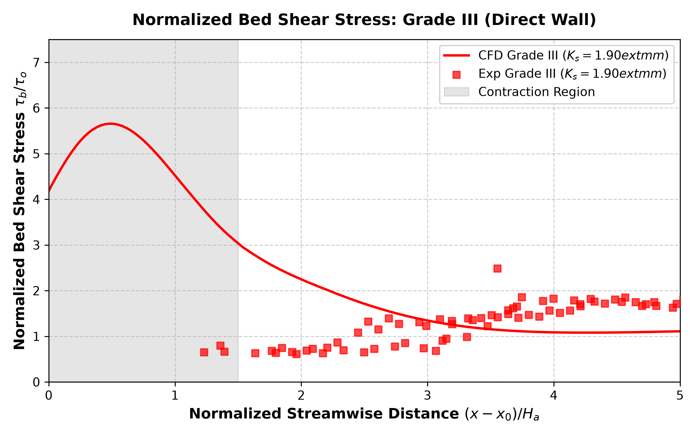
* **MRSSM Corrected:** 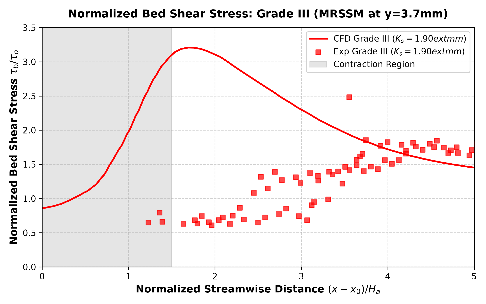

### 7.5 Velocity Contour Comparison
To analyze the global flow behavior and understand how bed roughness affects the boundary layer development, the streamwise velocity ($U_x$) contour was plotted individually for each roughness grade around the bridge contraction block ($x \in [0.5, 2.5]\text{ m}$).

* **Flow Field Analysis:** The contours clearly demonstrate the acceleration of the flow beneath the bridge (the throat region at $x \in [1.0, 1.15]\text{ m}$) as the ceiling constricts the flow area by 25%, causing a significant increase in streamwise velocity.
* **Roughness Effect:** As bed roughness ($K_s$) increases from Grade I (0.33 mm) to Grade III (1.90 mm), the near-wall velocity is retarded more significantly due to the increased shear resistance. This boundary layer retardation shifts the velocity profiles upward and downstream of the contraction block.

**1. Grade I (Ks = 0.33 mm) Velocity Contour**
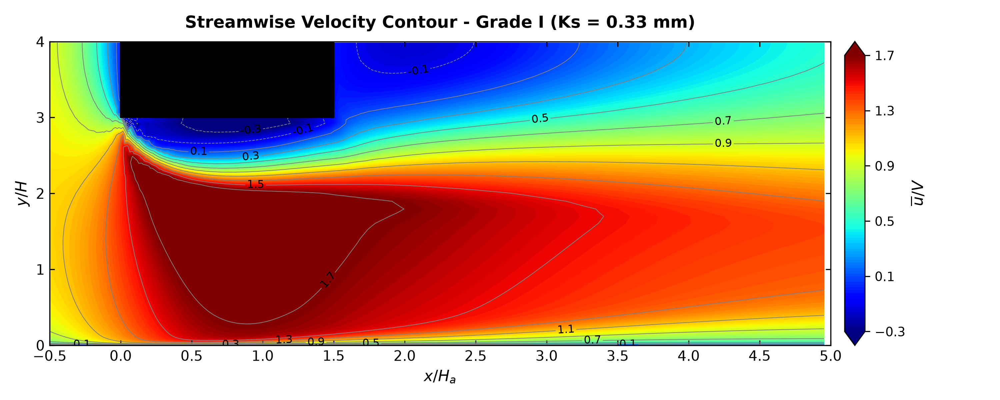

**2. Grade II (Ks = 0.68 mm) Velocity Contour**
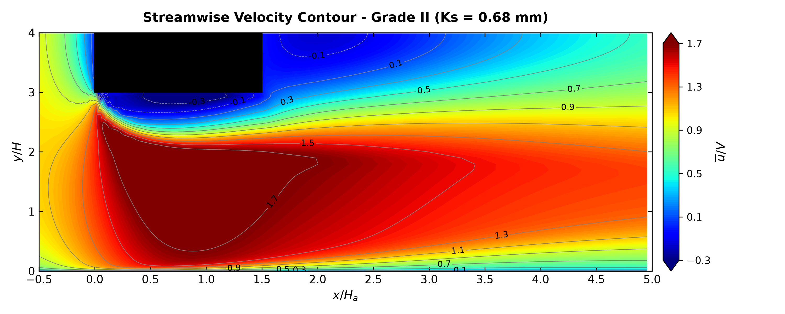

**3. Grade III (Ks = 1.90 mm) Velocity Contour**
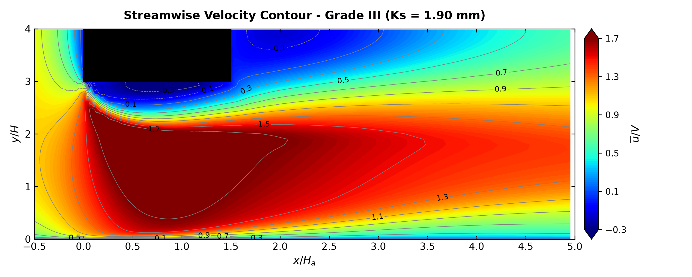

---

## 8. Prerequisites & Dependencies
*   **OpenFOAM v2412** sourced in the environment.
*   **Custom Wall Function Library:** The `libroughWallFunctions.so` library must be built and placed in the user library bin folder (`$FOAM_USER_LIBBIN`) to enable the `fuhrmanOmegaWallFunction` boundary condition.
*   **Python 3** with `numpy` and `matplotlib` packages for generating validation comparisons.

---

## Acknowledgements
The authors acknowledge the developers of **OpenFOAM** and the **LEGI (Laboratoire des Ecoulements Geophysiques et Industriels)** research team for developing the custom `roughWallFunctions` library to model rough-wall turbulent flows. 

Special thanks are also due to the authors of the reference paper, **Majid et al. (ASCE 2026)**, for providing high-fidelity experimental validation data enabling the validation of these numerical cases.
