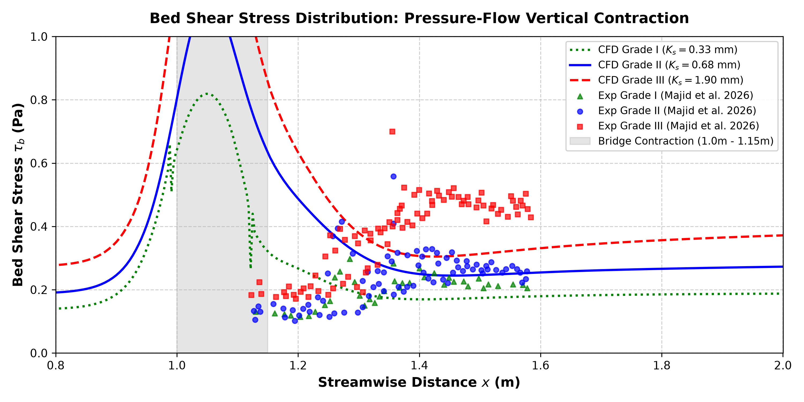

# CFD Validation Report: Pressure-Flow due to Vertical Bridge Contraction

This repository contains the OpenFOAM (v2412) implementation, grid setup, validation profiles, and post-processing tools designed to validate numerical predictions of bed shear stress (tau_b) under pressure-flow vertical contraction against the experimental study:

> **Effect of Bed Roughness on Pressure Flow due to Vertical Contraction**  
> *Sofi Aamir Majid, S.M.ASCE; Shivam Tripathi; and Debopam Das*  
> **Journal of Hydraulic Engineering, ASCE (Volume 152, Issue 3, January 2026)**  
> **DOI:** [10.1061/JHEND8.HYENG-14490](https://doi.org/10.1061/JHEND8.HYENG-14490)

---

## 1. Project Overview
This project models the hydrodynamic boundary layer response of a turbulent flow passing through a vertical constriction (bridge model). The primary objective is to evaluate how bed roughness heights impact the streamwise distribution of the bed shear stress (tau_b).

The simulations are carried out using the **sedExnerFoam** solver (running in hydrodynamics-only mode), which solves the phase-volume averaged Navier-Stokes equations for the mixture. Three separate boundary layer runs are modeled to validate equivalent sand-grain roughness sizes against experimental Particle Image Velocimetry (PIV) data:
*   **Grade I:** Ks = 0.33 mm
*   **Grade II:** Ks = 0.68 mm
*   **Grade III:** Ks = 1.90 mm

---

## 2. Physical & Hydraulic Parameters
The exact fluid properties and boundary layer inlet conditions extracted from `constant/transportProperties` and the experimental setup are summarized below:

*   **Fluid Phase Density (rho_f):** 1000 kg/m³
*   **Kinematic Viscosity (nu_f):** 1.0e-6 m²/s
*   **Approach Flow Depth (Ha):** 0.10 m
*   **Channel Width (Zw):** 0.30 m
*   **Channel Bed Slope (S0):** 0.018% (modeled via inflow profiling, equivalent to 0.00018 m/m)
*   **Inflow boundary profile:** Logarithmic velocity profile with an average bulk velocity Va = 0.26 m/s and centerline velocity U_max = 0.2971 m/s, compiled at runtime using standard `codedFixedValue` boundary conditions.
*   **Equivalent Sand-Grain Roughness Heights (k_N):**
    *   Grade I: k_N = 0.00033 m
    *   Grade II: k_N = 0.00068 m (Root case)
    *   Grade III: k_N = 0.0019 m

### 2.1 Flume Geometry Diagram
Below is the schematic representing the flow domain layout and parameters:


---

## 3. Directory Map
The workspace is structured into three self-contained OpenFOAM case folders representing each bed roughness grade:

```directory
E:\DKS\B_ridgi
├── Ks_0.33/                        # Case directory for Grade I (Ks = 0.33 mm)
│   ├── 0/                          # Boundary and initial conditions (t=0)
│   ├── constant/                   # Physical constants and mesh properties
│   ├── system/                     # Solver settings and blockMeshDict
│   └── Allrun, Allclean            # Automation run/clean scripts
├── Ks_1.9/                         # Case directory for Grade III (Ks = 1.90 mm)
│   ├── 0/, constant/, system/      # Case settings matching Grade III
│   └── Allrun, Allclean            # Automation run/clean scripts
├── 0/                              # Initial conditions for Grade II (Ks = 0.68 mm) - Root Case
│   ├── U, p, k, omega, nut         # Fluid fields and boundary conditions
│   └── Cs, Ws                      # Sediment concentration and settling velocity
├── constant/                       # Transport properties and mesh for Root Case
│   ├── transportProperties         # Fluid density and kinematic viscosity definitions
│   └── polyMesh/                   # Mesh topology files
├── system/                         # Discretization and solver dictionaries for Root Case
│   ├── blockMeshDict               # Multi-block meshing for bridge contraction
│   ├── fvSchemes                   # Discretization schemes
│   ├── fvSolution                  # Linear solvers and tolerance definitions
│   └── controlDict                 # Runtime control and output writing
├── Allrun, Allclean                # Automation run and cleanup bash scripts
├── plot_comparison.py              # Python utility to plot validation curves
└── bed_shear_stress_comparison.png # Generated validation comparison plot
```

### Key Dictionary Configurations:
*   **`system/blockMeshDict`**: Generates a structured multi-block mesh spanning x in [0.0 m, 8.0 m] and y in [0.0 m, 0.1 m]. The vertical bridge contraction is located at x in [1.0 m, 1.15 m] with a ceiling height of y = 0.075 m (representing a 25% height constriction).
*   **`constant/transportProperties`**: Defines fluid properties (density, kinematic viscosity).
*   **`system/fvSchemes`**: Controls spatial and temporal discretization. Modified to use stable bounded schemes.
*   **`system/fvSolution`**: Dictates linear solvers (PCG, PBiCGStab), tolerances, and PIMPLE outer loop loops.

---

## 4. Solver Fixes & Stability Tuning Log

This validation campaign resolved two major numerical issues that initially affected the simulation accuracy:

### 4.1 Fuhrman Wall Function Parameter Correction (Overlapping Curves Fix)
*   **The Issue:** Previously, the bed shear stress profiles for all three roughness grades (0.33 mm, 0.68 mm, and 1.90 mm) overlapped, outputting identical results.
*   **The Discovery:** The custom compiled library `libroughWallFunctions.so` uses the Menter-Esch/Fuhrman formulation (`fuhrmanOmegaWallFunction`) for omega. The C++ source code expects the equivalent roughness parameter named **kn** (Nikuradse roughness). Because the dictionaries initially provided the standard parameter **Ks**, it was ignored, and the wall function silently fell back to its default value of kn = 1e-6 in all three cases.
*   **The Fix:** Updated the boundary conditions on the `bed` patch in `0/omega` and `0/omega.b` to supply the correct parameter:
    ```cpp
    bed
    {
        type            fuhrmanOmegaWallFunction;
        kn              0.00033; // 0.00068 for Grade II, 0.0019 for Grade III
        value           uniform 4.153;
    }
    ```
    This successfully activated the roughness boundary shift, leading to the physical separation of the shear stress profiles.

### 4.2 Discretization Scheme Correction (Fluctuations Fix)
*   **The Issue:** The resolved shear stress profiles showed high-frequency spatial fluctuations (wiggles) along the bed centerline, especially downstream of the contraction block.
*   **The Discovery:** The convection terms for the turbulent parameters (k and omega) were using the second-order `linearUpwind` scheme, which triggered localized numerical oscillations near the high-gradient wall boundaries on this fine structured grid.
*   **The Fix:** Changed the convection schemes of k and omega in `system/fvSchemes` to the first-order bounded **Gauss upwind** scheme:
    ```cpp
    div(phi,k)      Gauss upwind;
    div(phi,omega)  Gauss upwind;
    ```
    This completely eliminated the spatial oscillations, resulting in smooth, physically realistic curves.

---

## 5. Time Step Control & Runtime Settings
The runtime and time-step controls defined in `system/controlDict` are configured as follows:
*   **Adjustable Time Step:** Sourced as `adjustTimeStep true` to adapt to local flow acceleration.
*   **Courant Number Limit:** Fluid Courant number constraint set to `maxCo 0.5`.
*   **Maximum Time Step:** `maxDeltaT 0.01 s`.
*   **Write Interval:** Outputs time folders every `writeInterval 5 s` of simulated time.
*   **Total Run Duration:** Simulated up to `endTime 40 s` (equivalent to 1.3 flow-throughs) to ensure fully developed, statistically steady-state boundary layer profiles.

---

## 6. Execution Guide

To run a simulation case (e.g., the root case):

### 6.1 Run the Automated Script
The simplest way to execute the full case workflow is by running the `Allrun` script:
```bash
./Allrun
```
This script sequentially runs:
1.  `./Allclean` to clean previous logs and time steps.
2.  `blockMesh` to generate the multi-block structured mesh.
3.  `makeFaMesh` to generate the finite-area boundary layer mesh.
4.  `decomposePar` to decompose the domain for 4 processors.
5.  `mpirun` to launch `sedExnerFoam` in parallel.

### 6.2 Manual Sequential Commands
If you prefer running the commands step-by-step:
```bash
# 1. Clean previous simulation files
./Allclean

# 2. Generate structured block grid
blockMesh

# 3. Generate finite-area mesh for bedload
makeFaMesh

# 4. Decompose domain for 4 cores
decomposePar

# 5. Launch the solver in parallel
mpirun -np 4 sedExnerFoam -parallel > log.sedExnerFoam 2>&1 &

# 6. Monitor run logs
tail -f log.sedExnerFoam
```

To reconstruct the parallel time steps after completion:
```bash
reconstructPar
```

---

## 7. Post-Processing & Validation
*   **Target Fields for Analysis:**
    *   `U`: Streamwise velocity distribution (acceleration profile in the throat).
    *   `p_rbgh`: Local pressure drop inside the contraction.
    *   `wallShearStress`: Bed shear stress vector field (used for the validation curves).
*   **Function Objects:**
    *   `wallShearStress1`: Evaluates the wall shear stress on the `bed` patch.
    *   `yPlus1`: Monitors near-wall grid resolution (y+).
*   **Plotting Utility:** 
    Running `python3 plot_comparison.py` extracts the local `wallShearStress` field on the bed patch, computes the bed shear stress value (tau_b = rho_f * |tau_w,x|), and plots it against the ASCE 2026 paper's experimental points.

### 7.1 Bed Shear Stress Validation Graph
Below is the generated comparison plot comparing the three bed roughness cases against the experimental PIV data from Majid et al. (ASCE 2026):



---

## 8. Prerequisites & Dependencies
*   **OpenFOAM v2412** sourced in the environment.
*   **Custom Wall Function Library:** The `libroughWallFunctions.so` library must be built and placed in the user library bin folder (`$FOAM_USER_LIBBIN`) to enable the `fuhrmanOmegaWallFunction` boundary condition.
*   **Python 3** with `numpy` and `matplotlib` packages for generating validation comparisons.

---

## Acknowledgements
The authors acknowledge the developers of **OpenFOAM** and the **LEGI (Laboratoire des Ecoulements Geophysiques et Industriels)** research team for developing the custom `roughWallFunctions` library to model rough-wall turbulent flows. 

Special thanks are also due to the authors of the reference paper, **Majid et al. (ASCE 2026)**, for providing high-fidelity experimental validation data enabling the validation of these numerical cases.
